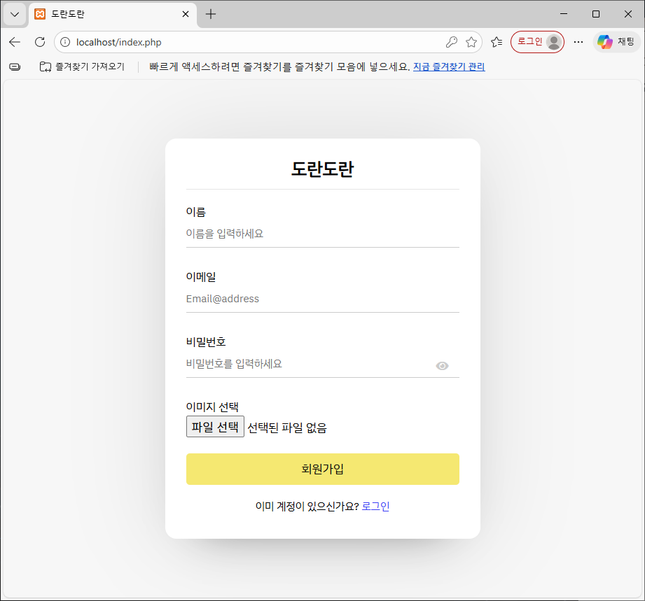
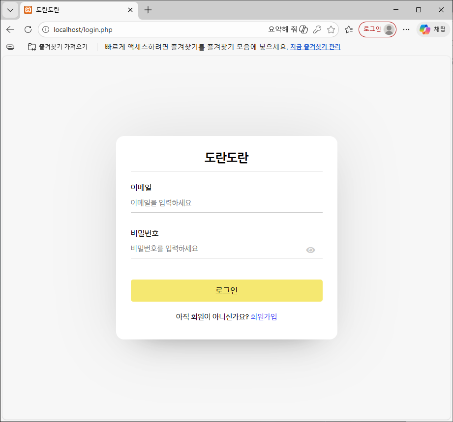
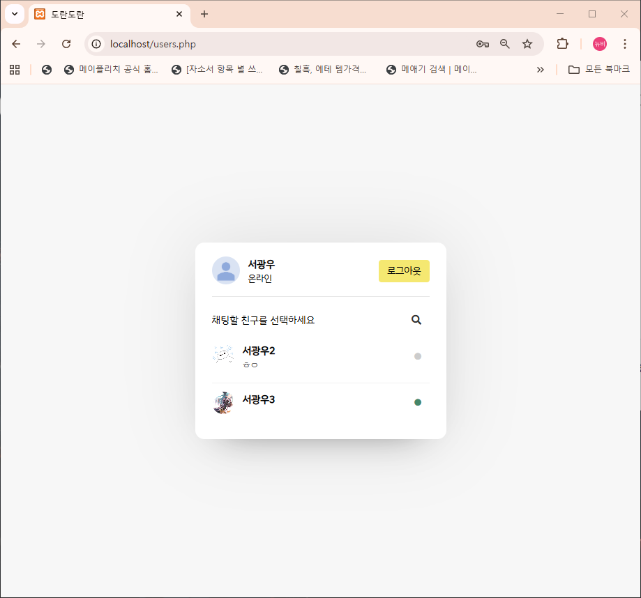
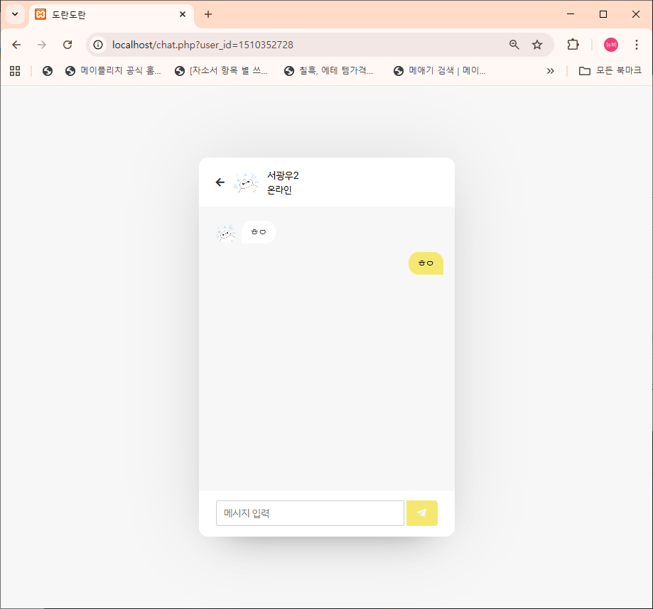
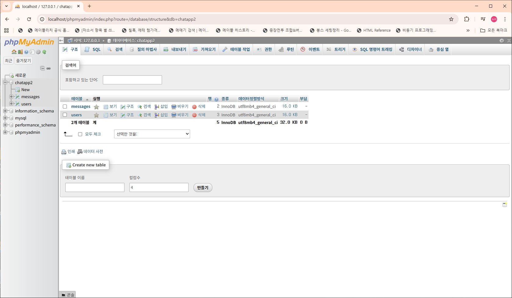
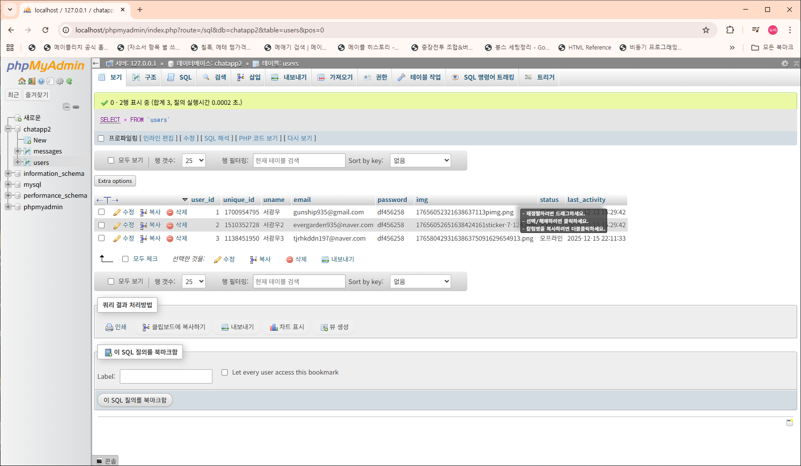
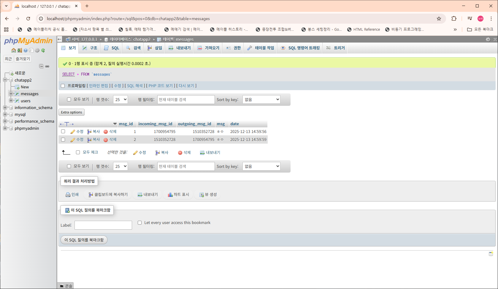

# 💬 도란도란 (Doran Doran)
**PHP & MySQL 기반의 비동기 실시간 웹 채팅 서비스**

웹 기반 채팅 플랫폼입니다. AJAX 통신을 통해 페이지 전환 없이 실시간 메시징이 가능하도록 구현했습니다.

## 🛠 주요 기술 스택
- **Backend**: PHP
- **Database**: MySQL
- **Frontend**: HTML, CSS, JavaScript (AJAX)
- **Environment**: XAMPP, VS Code

## 📸 핵심 기능 및 화면 구성

| 회원가입 및 로그인 | 실시간 유저 리스트 | 1:1 채팅 인터페이스 |
| :---: | :---: | :---: |
|   |  |  |
| **회원가입/로그인** | **실시간 상태 노출** | **실시간 메시지 송수신** |

---

## 💡 주요 개발 포인트 (Self-Review)

### 1. 데이터베이스 스키마 설계 (`chatdb.sql`)
- **보안 식별자 관리**: `users` 테이블에서 `unique_id`를 사용하여 외부 노출용 식별자를 별도로 관리함으로써 보안성을 높였습니다.
- **메시지 매칭 로직**: `messages` 테이블의 `incoming_msg_id`와 `outgoing_msg_id`를 활용해 대화 상대를 정확히 매칭하고 기록합니다.

| 전체 DB 구조 | `users` 테이블 상세 | `messages` 테이블 상세 |
| :---: | :---: | :---: |
|  |  |  |

### 2. 효율적인 코드 재사용 및 보안
- **SQL Injection 방지**: `mysqli_real_escape_string`을 사용하여 사용자 입력값에 대한 보안 처리를 적용했습니다.
- **UX 최적화**: CSS의 `word-wrap: break-word` 속성을 통해 긴 메시지 전송 시에도 레이아웃이 유지되도록 설계했습니다.

---

## ⚙️ 설치 및 실행 방법

1. 로컬 **XAMPP** 환경의 `htdocs`에 소스 코드를 복사합니다. 
2. `phpMyAdmin`을 통해 `chatdb.sql` 파일을 임포트합니다. 
3. `php/config.php`에서 DB 연결 정보(호스트, 아이디, 패스워드 등)를 확인한 후 브라우저에서 실행합니다.

